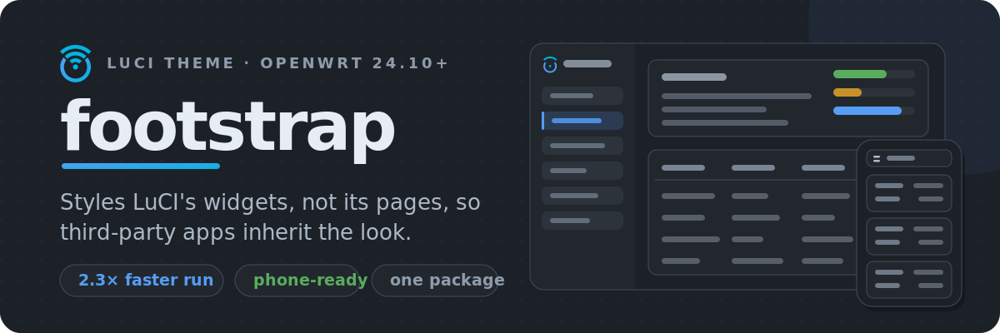
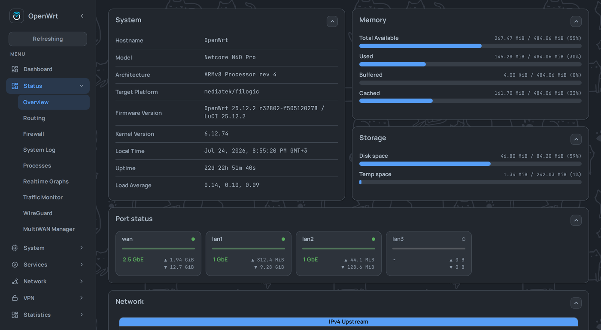
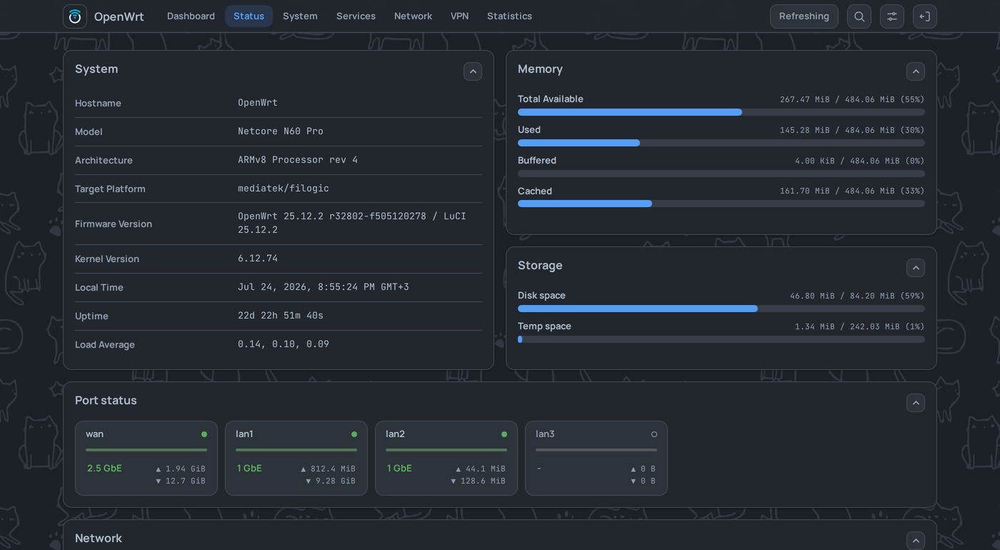
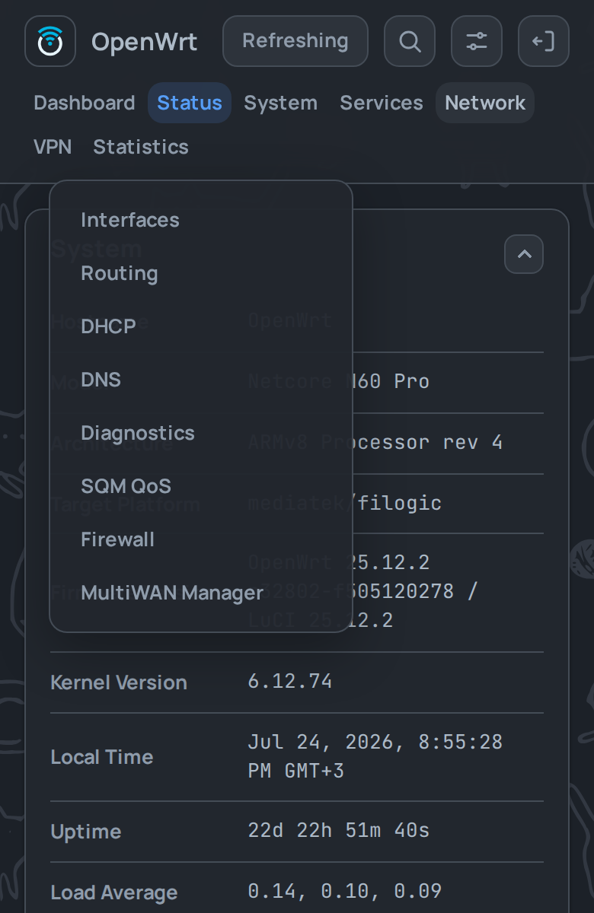
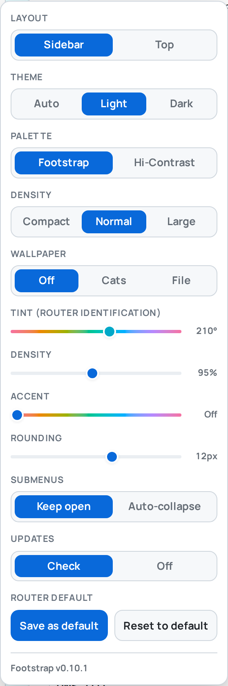
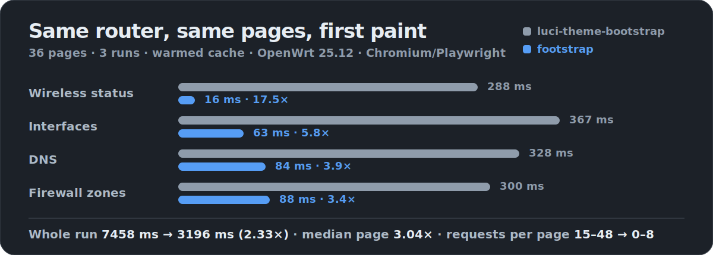

[English](README.md) · **Русский** ·
**[Песочница — всё можно потрогать без роутера](https://vizzletf.github.io/luci-theme-footstrap/playground.html)**

> [!IMPORTANT]
> **Обновление на 0.9.3 с 0.9.2 или раньше: обновляйтесь из консоли командой ниже — НЕ жмите кнопку
> *Update now* в веб-интерфейсе.** В 0.9.3 машинерия обновлений вынесена в отдельный необязательный
> пакет. Старый веб-апдейтер ставит только тему, которая эту машинерию больше не везёт, — то есть он
> удаляет собственный бэкенд посреди обновления: *Update now* затем падает с ошибкой «ресурс не
> найден», и обновления больше не предлагаются. Однократный запуск консольной команды ставит оба
> пакета и восстанавливает обновления. Разовый шаг, только для перехода на 0.9.3.





Боковое меню или верхняя панель — та же страница, та же разметка, разница в одной настройке браузера.
[Ещё скриншоты →](docs/screenshots/)

Замечания и предложения — в [issues](https://github.com/VizzleTF/luci-theme-footstrap/issues).




**Стилизует приложения, а не только стоковые разделы.** Оформление висит на общих правилах для
виджетов LuCI, поэтому сторонние `luci-app` (podkop, statistics и прочие) выглядят как системные
экраны сами по себе. Приложение со своим стилем остаётся при нём.

**Работает на телефоне.** Таблицы — процессы, DHCP-аренды, правила фаервола — сворачиваются в
карточки, формы выстраиваются в одну колонку, меню открывается тапом как попап. Горизонтального
скролла нет.

**Умеет обновляться сама.** О новых релизах GitHub спрашивает роутер, а не ваш браузер. Проверку можно
выключить, если не хотите, чтобы роутер куда-то стучался.

<br clear="left">

### На роутере — одна тема. Всё остальное живёт в браузере.

<picture>
  <source media="(prefers-color-scheme: dark)" srcset="assets/readme/appearance-dark.png">
  
</picture>

На роутере вы один раз выбираете **Footstrap** в **System → System → Language and Style**. Каждая ось
справа — настройка *браузера*: применяется сразу, без перезагрузки страницы, и на роутер ничего не
пишет.

- **Layout** — боковое меню или верхняя панель
- **Theme** — auto (следит за системой), светлая или тёмная
- **Palette** — Footstrap (цвета GitHub Primer) или Hi-Contrast
- **Density** — компактная, обычная или крупная
- **Wallpaper** — выключены, коты или своя картинка
- **Tint** — подмешивает оттенок в фон, чтобы понимать, какому роутеру принадлежит вкладка (или
  скриншот в тикете)
- **Accent** — перекрашивает кнопки, тумблеры, ползунки и кольца фокуса
- **Rounding** — радиус скругления, 0–20px
- **Submenus** — держать несколько разделов меню открытыми или сворачивать до одного

Понравившийся набор можно сохранить умолчанием для роутера — новый браузер начнёт с него.

<br clear="right">




Страницы переключаются без полной перезагрузки. Замер на 36 страницах против `luci-theme-bootstrap` на
одном и том же роутере, с прогретым кэшем, три прогона. Как прогнать замер у себя —
[docs/15](docs/15-benchmark-navigation.md).


По SSH одной строкой. Скрипт сам поймёт, apk у вас (25.12+) или opkg (24.10), скачает нужный пакет,
проверит его и поставит:

```sh
wget -qO- https://raw.githubusercontent.com/VizzleTF/luci-theme-footstrap/main/install.sh | sh
```

Дальше выберите **Footstrap** в **System → System → Language and Style**, поле «Design». Это
единственное, что задаётся на роутере. Нужна конкретная версия — добавьте тег: `... | sh -s v0.9.0`.

Пакет один, больше ставить нечего, каталог перевода едет внутри. Тема несёт русский каталог; на
других языках её собственные строки показываются по-английски, а общий хром (Menu, Logout) следует за
переводом `luci-base`.

Вручную качайте raw-файл из [релизов](https://github.com/VizzleTF/luci-theme-footstrap/releases)
(именно файл, а не zip-артефакт со страницы Actions):

```sh
apk add --allow-untrusted luci-theme-footstrap-*.apk   # 25.12+
opkg install luci-theme-footstrap_*.ipk                # 24.10
```

<details>
<summary>Про этот <code>--allow-untrusted</code></summary>

Флаг означает, что у apk и opkg нет ключа этого проекта, а не то, что байты никто не проверяет.
Проверка — работа самого установщика, и он отказывается, а не догадывается:

- любая загрузка идёт по проверенному TLS (никаких `-k`, даже второй попыткой);
- пакет сверяется с **подписью ed25519**, ключ от которой лежит только в CI. Это и есть главная
  проверка. Одного sha256 тут мало: GitHub *вычисляет* дайджест из того, что залили, поэтому тот, кто
  сумеет подменить ассет релиза, получит пересчитанный дайджест в подарок — и хеш сойдётся с его
  пакетом. Подпись такую подмену не переживёт;
- sha256, который публикует GitHub, тоже сверяется: он ловит обрезанную или подменённую загрузку с
  CDN ассетов, а это другой хост.

Подписывать начали с v0.9.0, поэтому у релизов по v0.8.5 включительно подписи нет и установщик их
отклонит — если не передать `FOOTSTRAP_ALLOW_UNVERIFIED=1`. Подпись, которая есть, но неверна, не
переопределяется ничем.

</details>


В [devkit для разработчиков](https://vizzletf.github.io/luci-theme-footstrap/) — сетка цветовых
токенов, разметка компонентов и проверялка стилей, куда можно вставить свой CSS.

Есть и текстовое руководство:
[как стилизовать приложение LuCI, чтобы оно работало под любой темой](docs/20-luci-app-styling-guide.ru.md)
— время жизни CSS, неймспейсы, цветовой контракт, детект тёмной темы и что делает эта тема, когда
приложение нарушает правила. Собрано по 30 реальным приложениям и проверено на роутере.

## Лицензия

Тема под Apache-2.0, и это не свободный выбор: `styles/base/` начинался как форк `cascade.css` из
[luci-theme-bootstrap](https://github.com/openwrt/luci), ucode-шаблоны производны от шаблонов LuCI, а
часть JS-хелперов скопирована из LuCI дословно. Всё это Apache-2.0, его notices едут вместе с ним, и
экосистема LuCI/OpenWrt тоже Apache-2.0.

Встроенные шрифты под неё не попадают. Manrope и JetBrains Mono — под
[SIL Open Font License 1.1](luci-theme-footstrap/htdocs/luci-static/footstrap/fonts/OFL.txt); её текст
и notices едут рядом со шрифтами, как того требует сама лицензия.

---

Внутреннее устройство, сборка и заметки по разработке — в [docs/](docs/). Ассеты самого README лежат в
[assets/readme/](assets/readme/), скриншоты воспроизводятся скриптом
[tools/readme-shots.py](tools/readme-shots.py).
